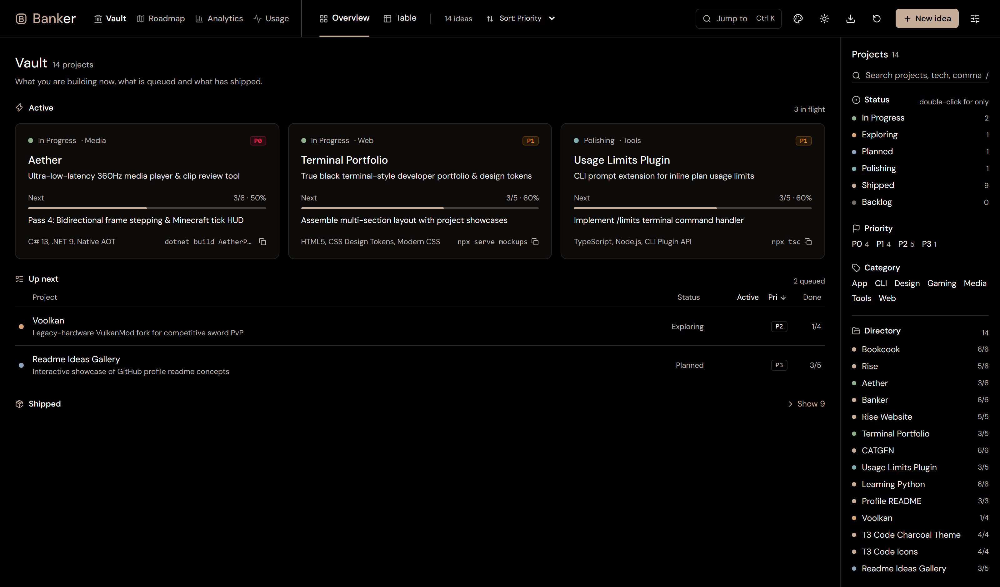
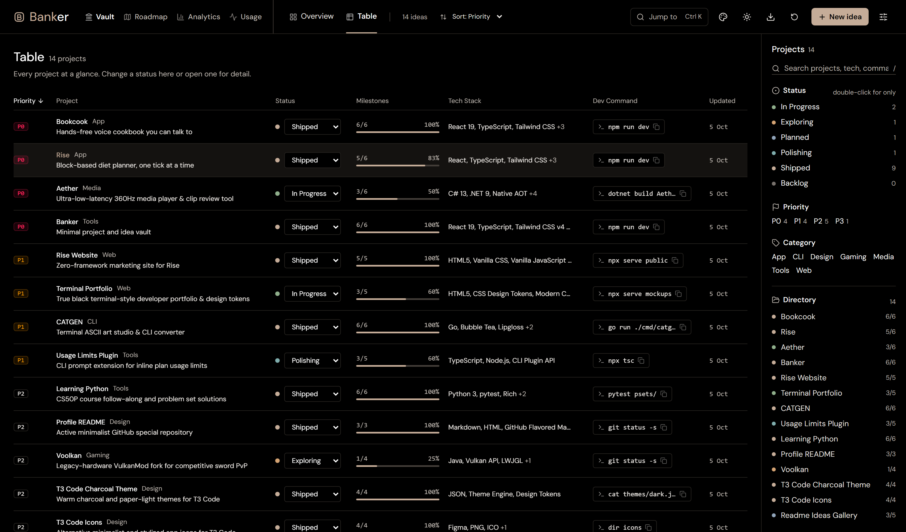
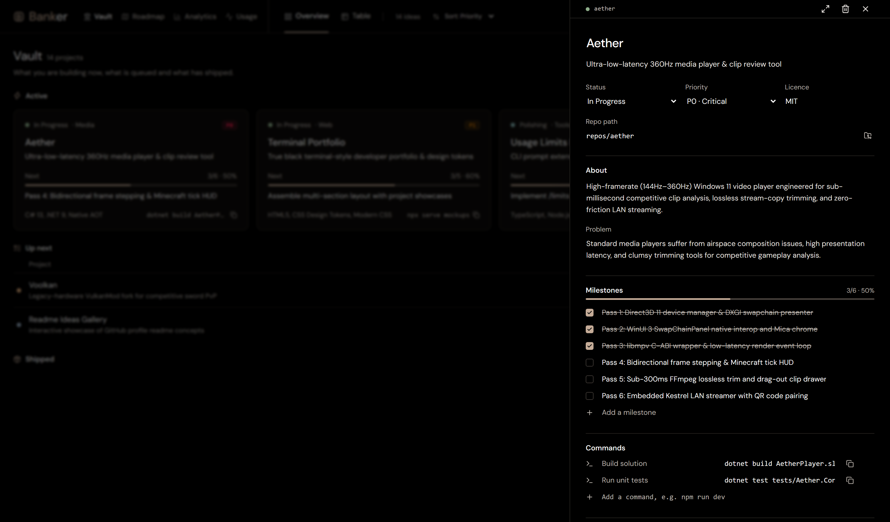
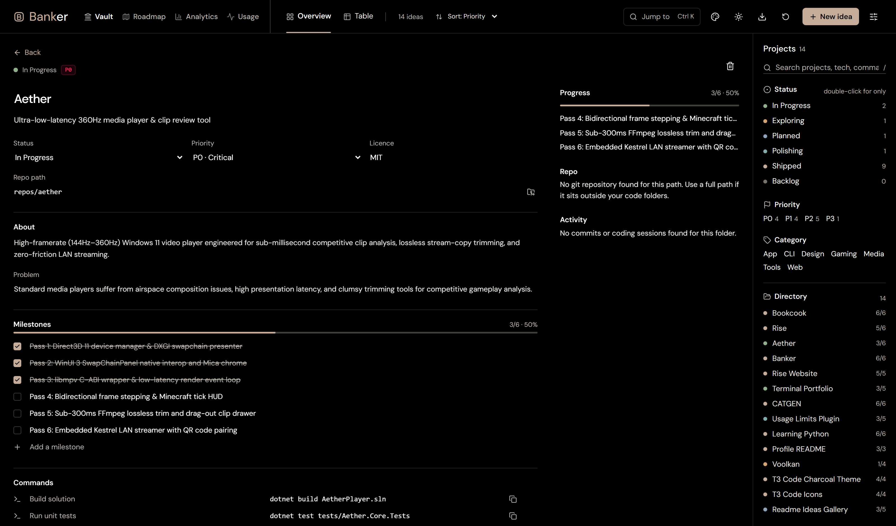
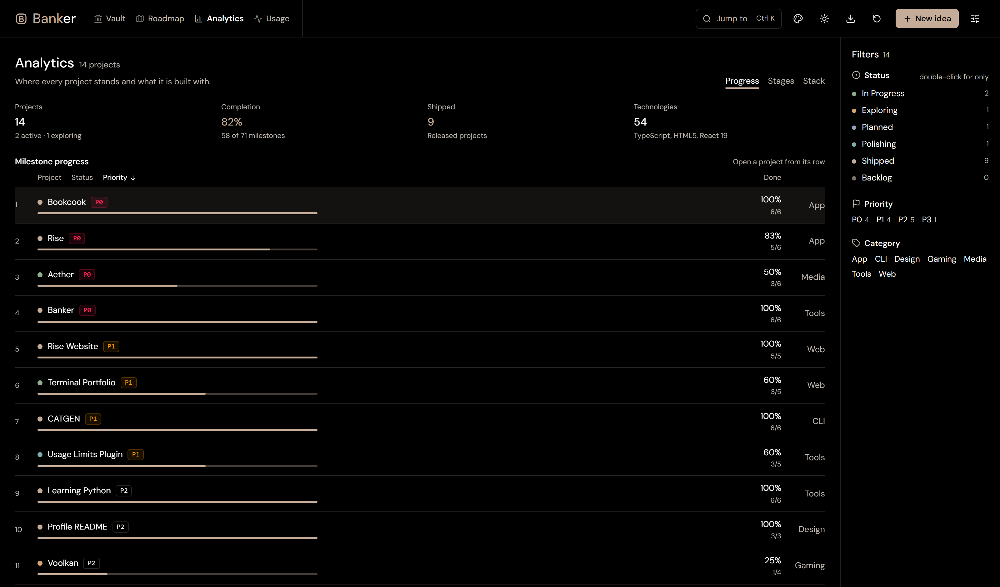
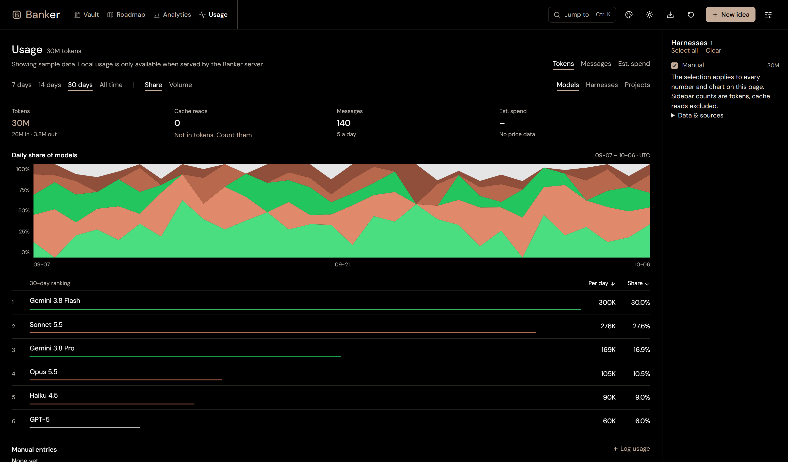
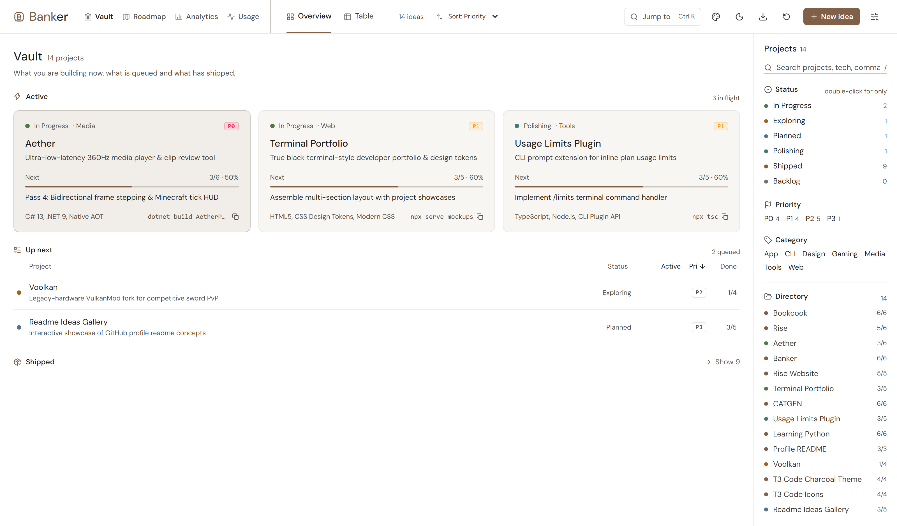
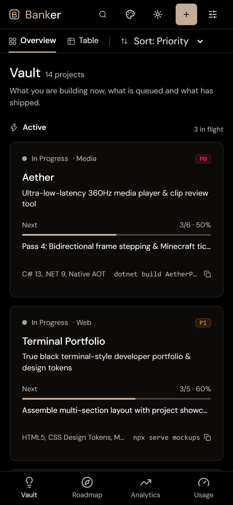
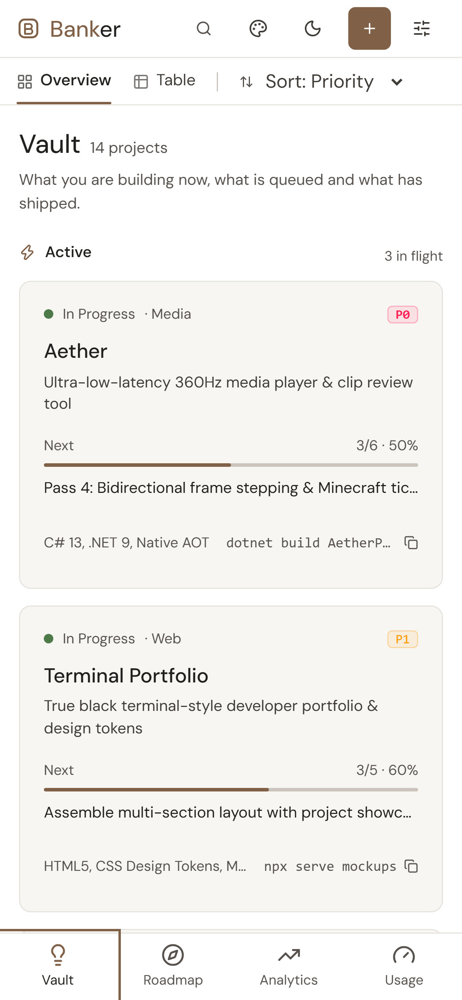
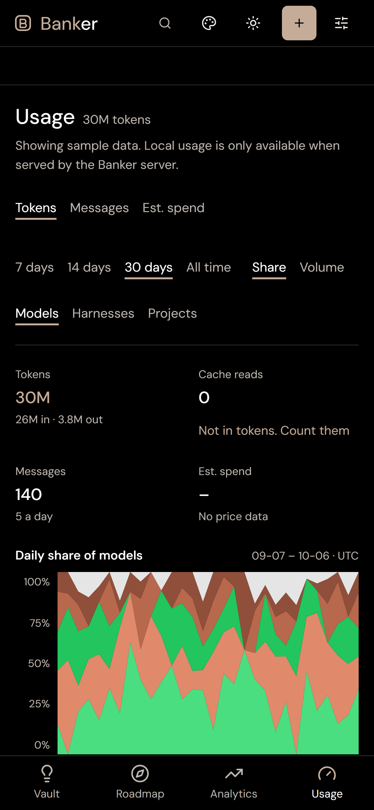

<div align="center">

<a href="https://rvyyv-n.github.io/banker/">
  
</a>

# Banker

**Minimal project and idea vault.**

A local-first developer workbench for tracking software tools, technical specifications, and roadmap milestones.

[**Open the app**](https://rvyyv-n.github.io/banker/) • [GitHub](https://github.com/rvyyv-n/banker) • [License: MIT](LICENSE)

</div>

<a href="https://rvyyv-n.github.io/banker/">
  
</a>

## Contents

- [What it does](#what-it-does)
- [Views](#views)
- [Token usage](#token-usage)
- [Running locally with your own projects](#running-locally-with-your-own-projects)
- [Privacy and storage](#privacy-and-storage)
- [How it's built](#how-its-built)
- [Development](#development)
- [License](#license)

## What it does

Banker provides a single place to track software tools through their entire
lifecycle: from initial spark and architectural spike through execution,
polishing, and release.

- **Six stages.** Move projects through *Backlog*, *Planned*, *Exploring*,
  *In Progress*, *Polishing* and *Shipped* from the table or the project page.
- **Git-aware cards.** Projects with a repo path show their branch, uncommitted
  files, unpushed commits and how long since the last commit or coding session.
  Read locally by the server, never sent anywhere.
- **Themes.** Four accent themes in dark and light, switched from the palette
  menu or the command palette. Text and status colours are contrast-tested.
- **Sortable everywhere.** Click any column or section head to sort, again to flip.
- **Checklists with live progress.** Every project tracks its milestones,
  updating progress meters in real time.
- **Specs and decisions.** Keep problem statements, architectural rationale,
  and upstream references attached directly to each project card.
- **Terminal shortcuts.** Store and copy relevant working directory paths,
  git status queries, and dev commands in one tap.
- **Scratchpad.** Write notes and brainstorm thoughts directly inside each
  drawer without switching apps.
- **Token usage across your tools.** A Usage page reads your local Claude Code
  and Antigravity logs and shows tokens, messages and estimated spend by model,
  harness and project.
- **Built for phones.** Bottom navigation and card lists.
- **Zero data loss.** Everything syncs to browser storage instantly, with
  one-click JSON export for backups and cross-machine handoffs.

## Views

### Overview

The default view. Active work (in progress and polishing) is shown as cards with
progress, the next unfinished milestone, tech stack, a copyable dev command and
repo status. Queued projects follow as a sortable list, and shipped ones fold away.

<a href="https://rvyyv-n.github.io/banker/">
  
</a>

### Table

A dense, high-efficiency developer data grid designed for quick audits. Scan
repositories, inspect active milestones, copy terminal commands and folder paths
in one click, and update project stages inline.

<a href="https://rvyyv-n.github.io/banker/">
  
</a>

### Project drawer and page

Clicking any card opens a slide-over panel with the full technical specification,
interactive milestone checklists, linked workspaces, terminal commands, and an
editable scratchpad. The expand button opens the same editor as a full page, with
progress, repo details and activity beside it.

<a href="https://rvyyv-n.github.io/banker/">
  
</a>

<a href="https://rvyyv-n.github.io/banker/">
  
</a>

### Analytics

Slopalytics-inspired performance and execution benchmarks. Track task completion velocity,
lifecycle distribution matrices, priority weighting, and tech stack intelligence across your entire vault.

<a href="https://rvyyv-n.github.io/banker/">
  
</a>

### Usage

Token usage by model, harness and project, in the style of Slopalytics. Switch
between **Tokens**, **Messages** and **Est. spend**, pick a 7, 14, 30 day or all-time
window, and view the **Share** (100% stacked) or **Volume** chart. Drag a finger
across the chart to read a day. A ranked table shows per-day averages and the
change in share against the previous period. See [Token usage](#token-usage) for where
the numbers come from.

<a href="https://rvyyv-n.github.io/banker/">
  
</a>

### Light mode

Crisp, paper-like neutral styling with stark typography. Press <kbd>T</kbd>
anywhere or tap the sun/moon icon to switch between OLED Dark and Light mode. The
palette menu in the header changes the accent colour.

<a href="https://rvyyv-n.github.io/banker/">
  
</a>

### Mobile

Built for one-handed use. A bottom tab bar switches sections, the table becomes a
list of cards, and filters open as a full-screen sheet. Tap targets are at least 40px.

<p align="center">
  <a href="https://rvyyv-n.github.io/banker/">
    
  </a>
  &nbsp;
  <a href="https://rvyyv-n.github.io/banker/">
    
  </a>
  &nbsp;
  <a href="https://rvyyv-n.github.io/banker/">
    
  </a>
</p>

## Running locally with your own projects

To run Banker on your local machine and point it to your repositories:

1. **Clone and install**:
   ```sh
   git clone https://github.com/rvyyv-n/banker.git
   cd banker
   npm install
   ```

2. **Start the local server**:
   ```sh
   npm run dev
   ```
   Open `http://localhost:3333/`.

3. **Managing your projects**:
   - **Through the UI**: Use the `+` button (or press <kbd>N</kbd>) to add your own local projects with their directory paths and dev commands.
   - **Pre-seeding via code**: Edit `src/data/initialData.ts` to define your own default catalog of repositories and initial milestones.
   - **Repo status**: set a project's repo path (relative to a folder above this one, or a full path inside your code folders) to see its branch and activity. Set `BANKER_ROOT` to your code folders, separated by `;` on Windows, to change where paths resolve.
   - **Backups & Sync**: Use **Export** in the header to save a `banker-vault.json` snapshot of your project state anytime.

## Token usage

The Usage page shows real numbers when Banker runs on your own machine
(`npm run dev`, `npm run preview` or `npm run serve`). A small collector,
[`scripts/usage-collector.cjs`](scripts/usage-collector.cjs), reads:

| Source                     | Location                                          |
| -------------------------- | ------------------------------------------------- |
| Claude Code sessions       | `~/.claude/projects/**/*.jsonl`                  |
| Antigravity (Gemini) chats | `~/.gemini/antigravity-acp/conversations/*.db`   |

and serves the daily totals at `/usage.json`. Messages are de-duplicated, spend is
estimated from list prices in T3 Code's cached price table when it exists, and
anything without a price is left out of the spend total. **Tokens** means fresh
tokens (input, output and cache writes); cache reads are shown separately because
they are usually far larger.

- Tools that don't leave local logs can be added with **Log usage** on the page.
- On the hosted GitHub Pages site there are no local logs, so the page shows sample
  data and says so.
- The Antigravity token fields are decoded from an undocumented format, so treat
  those counts as estimates.
- `/usage.json` is served to anything that can reach the server, including other
  devices on your network, and it contains project names. Don't expose the server
  publicly.

## Privacy and storage

Banker is strictly local-first. Your ideas, notes, status changes, and
custom projects stay entirely in your browser's local storage. Usage data is read
from your own machine by the local server and is never sent anywhere else.

- No external analytics, telemetry, or user accounts.
- Zero tracking scripts or third-party network requests.
- Export your complete vault to JSON anytime using the **Export** button in the
  header.

## How it's built

Built with React 19, TypeScript, and Vite with Tailwind CSS v4.

```
icon.svg                  clean vector mark for repository and documentation
icon.png                  512x512 high-resolution app icon
src/
  App.tsx                 app shell, theme provider, and view orchestrator
  types.ts                typed project schema, status enums, and milestones
  index.css               pure OLED dark (#000000) and paper light CSS tokens
  data/
    initialData.ts        initial project catalog and milestone seeds
    status.ts             stages, priorities, progress helpers and status colours
    accents.ts            accent theme list
    repos.ts              fetches repo status and last activity for projects
    usage.ts              usage types, providers and sample data
  components/
    Header.tsx            Slopalytics-style navigation header with section & view tabs
    Sidebar.tsx           Slopalytics-style filter sidebar with status, priority, and quick directory
    BankerLogo.tsx        three stacked ledger bars mark
    MobileNav.tsx         bottom tab bar for phones
    UsageView.tsx         token usage by model, harness and project
    VaultOverview.tsx     active cards, sortable queue and shipped list
    ProjectBody.tsx       editable project fields shared by the drawer and page
    ProjectPage.tsx       full-page project view with repo and activity rail
    TableView.tsx         high-density developer data grid with 1-click command & path copy
    RoadmapView.tsx       four-phase ecosystem execution timeline
    AnalyticsView.tsx     Slopalytics-style velocity, distribution, and tech stack intelligence
    ProjectDrawer.tsx     slide-over drawer with checklists and scratchpad
    NewProjectModal.tsx   fast idea capture modal
screenshots/              retina edge-to-edge screenshots of views and mobile layout
scripts/
  repo-status.cjs         read-only git status and last activity for project folders
  e2e.cjs                 end-to-end and contrast checks
  host.cjs                background server for npm run host
  usage-collector.cjs     scans local Claude Code and Antigravity logs for token usage
capture.cjs               automated headless Chrome screenshot capture script
server.cjs                standalone local server for the built app and /usage.json
```

## Development

Needs Node 20+.

```sh
npm install
npm run dev
```

Open the address Vite prints (default `http://localhost:3333`).

| Command               | What it does                                                 |
| --------------------- | ------------------------------------------------------------ |
| `npm run dev`         | Start the Vite dev server with hot module reloading          |
| `npm run build`       | Typecheck and build the production bundle to `dist/`         |
| `npm run check`       | Lint, typecheck and build (what CI runs)                     |
| `npm run test:e2e`    | Build, start the server on a free port, check every section on desktop and phone in headless Chrome, test theme contrast, then stop |
| `npm run preview`     | Preview the production build locally with Vite               |
| `npm run serve`       | Serve `dist/` and live usage on port 3333, reachable on your LAN |
| `npm run host`        | Build and run the same server in the background; prints local and LAN URLs and returns |
| `npm run host:stop`   | Stop the background server (`host:status` shows if it's up) |
| `node capture.cjs`    | Retake high-resolution screenshots via headless Chrome       |

`host` and `test:e2e` take a `PORT` environment variable (`host` defaults
to 3333). The background server logs to `banker-host-<port>.log` in the
system temp folder.

### Keyboard shortcuts

| Key                | Action                              |
| ------------------ | ----------------------------------- |
| <kbd>N</kbd>       | Open the new project modal          |
| <kbd>T</kbd>       | Toggle between OLED dark and light  |
| <kbd>/</kbd>       | Focus the search filter             |
| <kbd>1</kbd>       | Switch to the overview              |
| <kbd>2</kbd>       | Switch to the table                 |
| <kbd>3</kbd>       | Switch to the Roadmap view          |
| <kbd>4</kbd>       | Switch to the Analytics view        |
| <kbd>5</kbd>       | Switch to the Usage view            |
| <kbd>Esc</kbd>     | Close the active drawer or modal    |

## Deployment

Pushes to `main` trigger [`.github/workflows/deploy.yml`](.github/workflows/deploy.yml),
which checks out the repository, installs dependencies, runs `npm run check`
(lint, typecheck and build),
and publishes the static bundle directly to GitHub Pages.

## License

[MIT](LICENSE) © rvyyv-n
